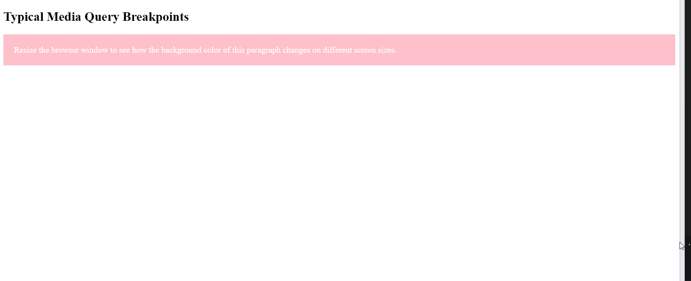

# CSS Media Queries Exercise

you will practice using CSS media queries to create a responsive design that adapts to various screen sizes. The provided code demonstrates how media queries can be used to change the background color of a paragraph based on the width of the viewport.

## Instructions
Understanding Media Queries:

Media queries are CSS rules that allow you to apply styles based on the characteristics of the device, such as screen width, height, or orientation.
Each media query targets a specific range of screen sizes using the min-width and max-width properties.
Getting Started:

Use media queries in your CSS file to adjust the styles of the element based on different screen sizes.
Follow these exact steps:
For screen sizes under 500 pixels, the background color of the element should be pink.
For screen sizes between 500 pixels and 800 pixels, the background color should be green.
For screen sizes between 800 pixels and 1000 pixels, the background color should be blue.
For screen sizes between 1000 pixels and 1200 pixels, the background color should be orange.
For screen sizes 1200 pixels and above, the background color should revert to pink.

Resize the browser window to different widths to see how the background color of the element changes at each breakpoint.

## Desired Outcome

